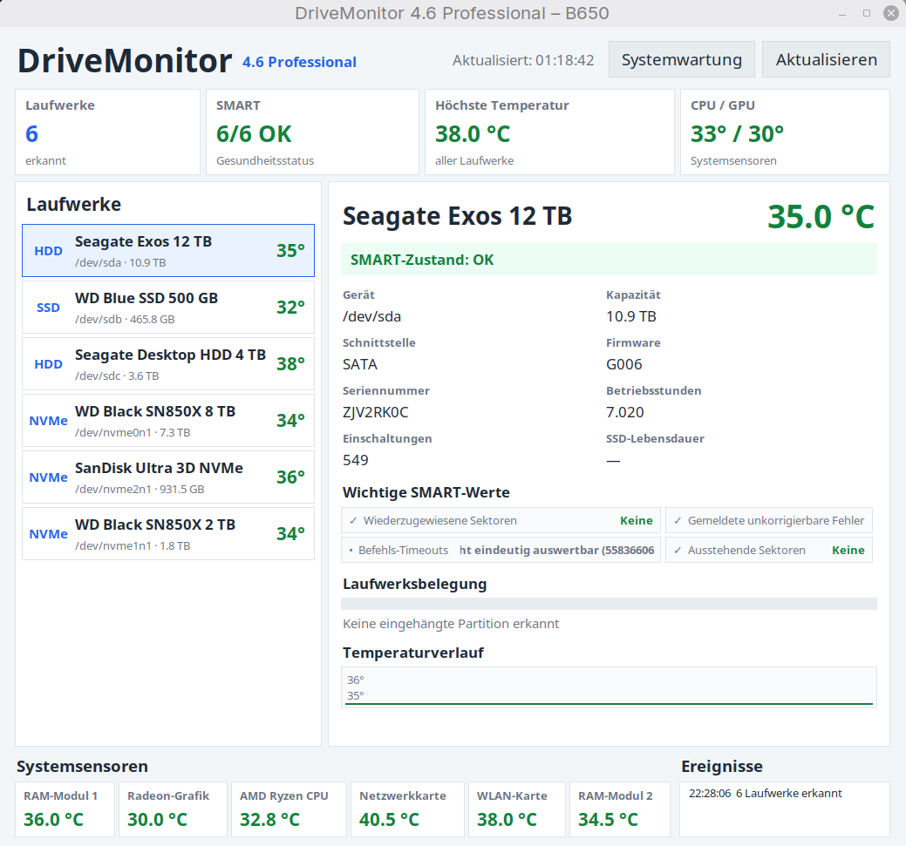

  

# DriveMonitor 4.6 Professional

Professional SMART and System Monitoring for Linux Mint

DriveMonitor Professional is a modern monitoring tool for Linux systems.
It combines SMART health monitoring, system temperature monitoring and
a clear dashboard in a single application.
## Screenshot

---

## Features

- SMART health monitoring for HDD, SSD and NVMe drives
- Detailed drive information
- CPU temperature monitoring
- GPU temperature monitoring
- RAM temperature monitoring (where supported)
- Network and WLAN monitoring
- Temperature history
- Event log
- Professional dashboard
- Automatic refresh
- Report generation
- System maintenance tools

---

## Current Release

**DriveMonitor 4.6 Professional**

Latest stable release featuring the new Professional Dashboard.

---

## Requirements

- Linux Mint 22.x or newer
- Python 3
- smartmontools
- lm-sensors

---

## Screenshot

*(A screenshot of DriveMonitor 4.6 can be added here.)*

---

## License

Open Source
