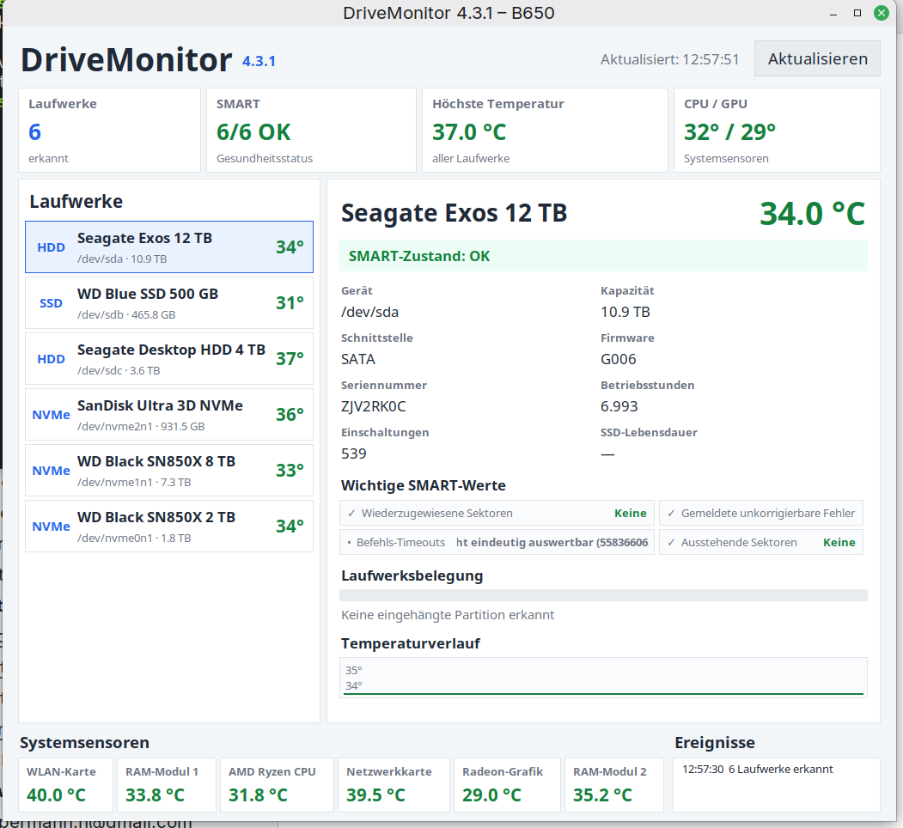

# DriveMonitor

A modern SMART and temperature monitor for Linux.

DriveMonitor provides a clear overview of storage health and temperatures for
HDDs, SATA SSDs and NVMe drives. It was developed and tested on Linux Mint.



## Features

- HDD, SSD and NVMe temperature monitoring
- SMART health overview
- Important SMART attribute interpretation
- Drive capacity and filesystem usage
- Power-on hours and power-cycle count
- SSD lifetime information where available
- Temperature history
- System sensor overview for CPU, GPU, RAM and network devices
- Session event log
- Linux desktop notifications for temperature and SMART warnings
- Automatic startup without repeated password prompts
- Compact interface positioned on the right side of the screen

## Requirements

DriveMonitor currently targets Linux Mint and similar Debian/Ubuntu-based
distributions.

Required packages:

```bash
sudo apt install python3 python3-tk smartmontools lm-sensors libnotify-bin
```

Run sensor detection if it has not been configured before:

```bash
sudo sensors-detect
```

## Installation

DriveMonitor is currently distributed as a Python application.

Create the installation directory:

```bash
mkdir -p ~/.local/share/drivemonitor
```

Copy the main program:

```bash
cp src/drivemonitor.py ~/.local/share/drivemonitor/
chmod +x ~/.local/share/drivemonitor/drivemonitor.py
```

Start it manually:

```bash
pkexec python3 ~/.local/share/drivemonitor/drivemonitor.py
```

## Autostart without a password prompt

The scripts in `scripts/` install a restricted Polkit rule and a protected
copy of DriveMonitor under `/opt/drivemonitor`.

Run:

```bash
chmod +x scripts/autostart-einrichten.sh scripts/autostart-entfernen.sh
./scripts/autostart-einrichten.sh
```

The administrator password is required once during setup. DriveMonitor will
then start automatically after login without asking for the password again.

To remove the autostart configuration:

```bash
./scripts/autostart-entfernen.sh
```

## Temperature thresholds

- Below 50 °C: normal
- From 50 °C: warning
- From 60 °C: critical warning

## Current version

**4.3.2**

## License

DriveMonitor is released under the MIT License.

## Author

Horst Oppermann — GitHub: [Oppi0815](https://github.com/Oppi0815)
